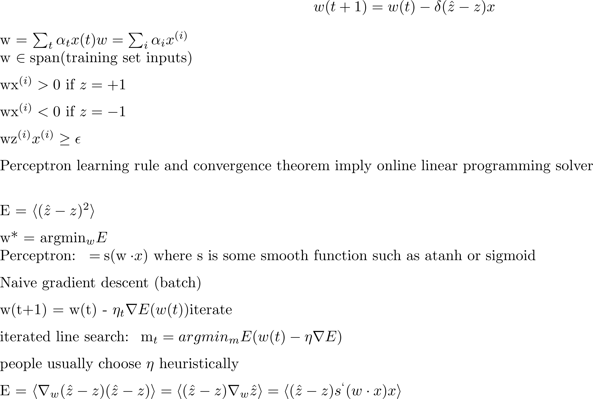

## Machine Learning and Neural Networks - cs401 - Barak Pearlmutter

### Lecture 4

- [Rosenblat pereceptron](https://en.wikipedia.org/wiki/Perceptron)

Caveats: Training set, check set (These systems need to generalize well)

_Deep learning has it routes in the perceptron_

- [Support Vector Machines](http://docs.opencv.org/2.4/doc/tutorials/ml/introduction_to_svm/introduction_to_svm.html)
- [back propagation](https://en.wikipedia.org/wiki/Backpropagation)
- [Deep learning](https://en.wikipedia.org/wiki/Deep_learning)

**Perceptron:**

problem = [Linear Programming](https://en.wikipedia.org/wiki/Linear_programming) - [Dantzig](https://en.wikipedia.org/wiki/George_Dantzig)

 