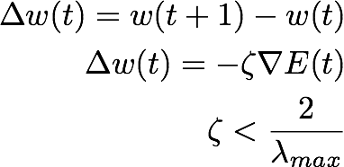

# Momentum
If the error surface is very long and narrow valley, then the weight will move quickly down the valley but very slow along the valley floor. in this diagram if our learning rate was greater than the distance horizontal distance from the current position of the weights to the bottom of the valley then the weights move up the other side of the valley after the next training step.   
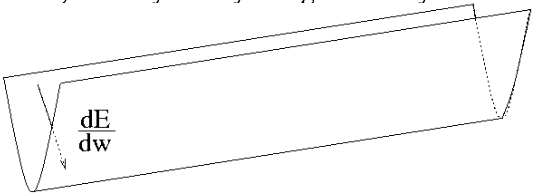  
[source (slide 13)](https://www.cs.toronto.edu/~hinton/csc2515/notes/lec6tutorial.pdf)

This results in the weights taking steps that seem to zigzag across the weight space with big variations along one axis which results in us taking more steps than needed to reach the optimum.  
  
When gradient descent keeps changing direction, adding a momentum variable causes it to to smooth out the variations.  
You can imagine this as adding gravity into our weight updates, allowing us to not continue mowing back up the other side of the valley so much.  

  
Adding this into our formula we get  
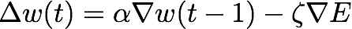  
where alpha represents the momentum. This formula essentially says take the amount we moved the previous time and in this direction and add it to the new location change. Notice in the second diagram above the oscillations in the y direction are less severe than the first diagram and the x direction grows quicker. This is because the momentum term prevents the y changes varying too much and the x changes happen a little quicker.  
This version of gradient descent has a constant time
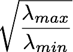  

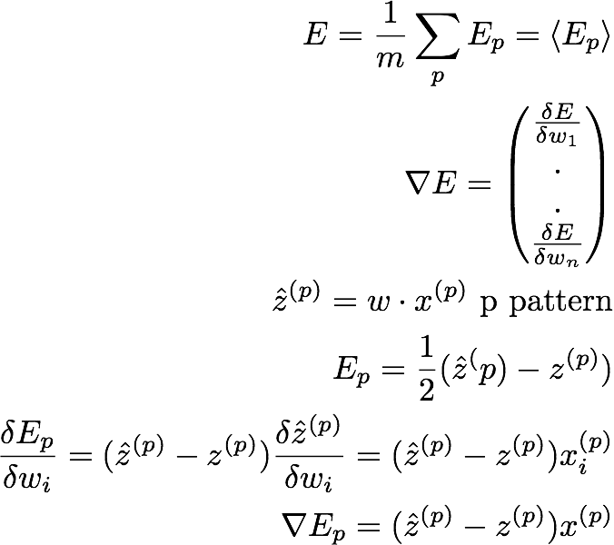  

# Activation Functions
The following images are examples of activations functions. In system s such as neural networks we multiply our weights by the input vector which gives us an output. The brain does a similar process and then the neuron computes a simple function to determine whether or not it is "activated" and should pass a 0 or 1 to the next level of the network.   
## Sigmoid
  
## Step function
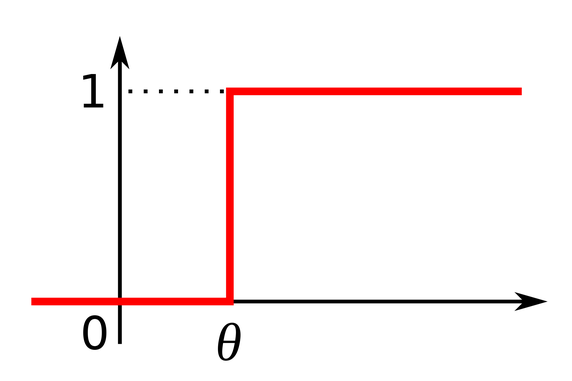
# tanh

Applying this activation function we get the following  
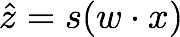  
Which means the error function has gradient  
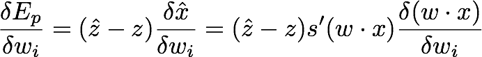

## Calculus Refresher
What if we don't actually know the function we wish to differentiate? say we only have some function f(x) that we can evaluate at a point. To find it's derivative we can differentiate by first principles  
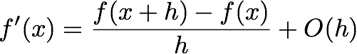  
where O(h) is a small error term  

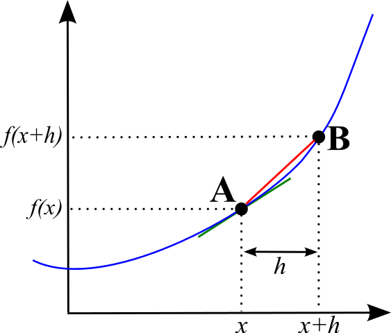  
This biases our derivative if say the function going right of x has greater slope than going left, thus we take the 2 sided approximation over the 1 sided  
Applying this formula requires O(n)evaluations of the error function to calculate the hessian matrix  

### Cardinal Sins of Numerical Computation
* add little and big numbers
* subtract two nearly equal numbers

But our gradient calculation above does both!  
This means we should try find another algorithm to do this, avoiding potentially nasty numeric errors  
These algorithms might be more complex to write so we'll still use the first principles approach to verify our answer (called gradient checking)  

# Backpropagation

Backpropagation allows us to computer the gradient in our network through recursive applications of the chain rule.  
Lets say we have input w  
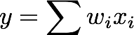  

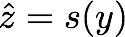  

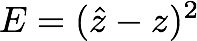

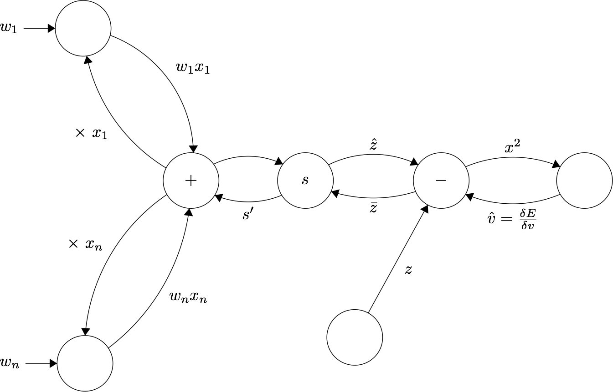

Computing the error goes left tho right. Computing 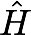 goes right to left  
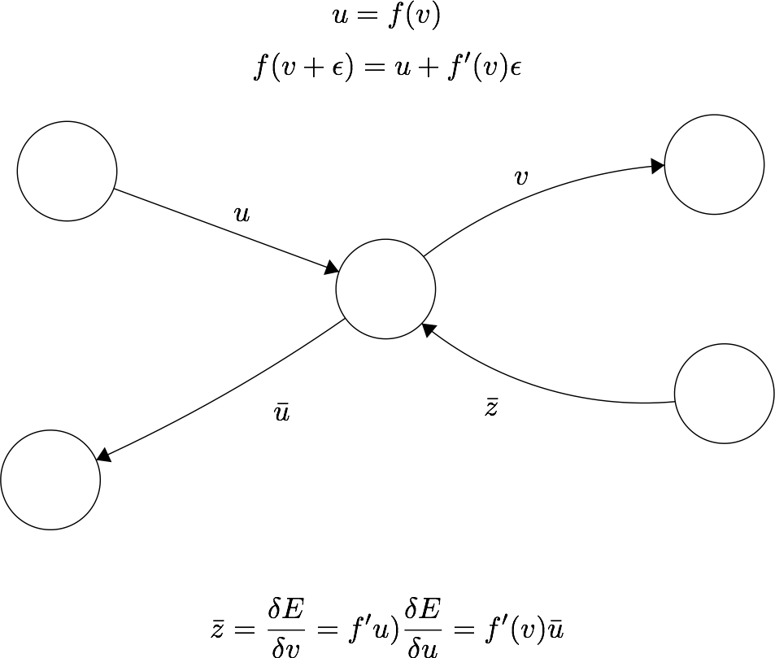  

[more backpropagation notes](http://cs231n.github.io/optimization-2/)
