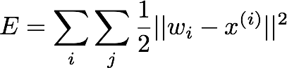
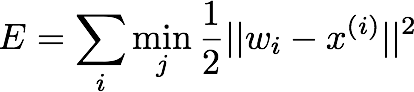
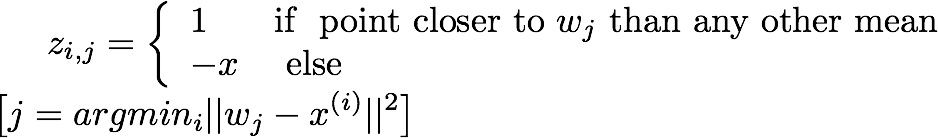
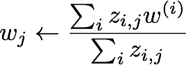
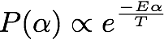
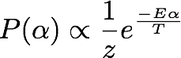
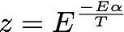
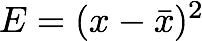
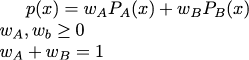
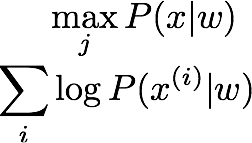

# K-Means Clustering

Maybe the means keep moving around  
### Error Function
We can model the error in our system by:  
  
The problem with this is that it includes the distance from each mean to each point, but our real error is the sum of distances from each point to the closest mean  
  

## Batch Algorithm for K-Means
Imagine instead that we had springs from each mean to all the points classified as that type.Then we can define a variable z for each point and mean defined as follows  
  

To update weights we use the formula  
for j =0...  
  
This can be viewed as a two step process:
 * assign to nearest cluster  
 * move cluster centre to middle of points  
This converges in a finite number of iterations as there are only finitely many values for all the z terms so it must converge to some value, even if that is only a local optimum  
invariant:   
However, this is an integer program which is in NP!
We could relax the condition that z_i,j is 0 or 1 to give us a linear program which we can solve to get a probability that each example is in one of the clusters  
  

## [Boltzmann Distribution](https://en.wikipedia.org/wiki/Boltzmann_distribution)
  
  
  
  

Gaussian = Boltz Distribution over a qudratic bowl.

    

  
